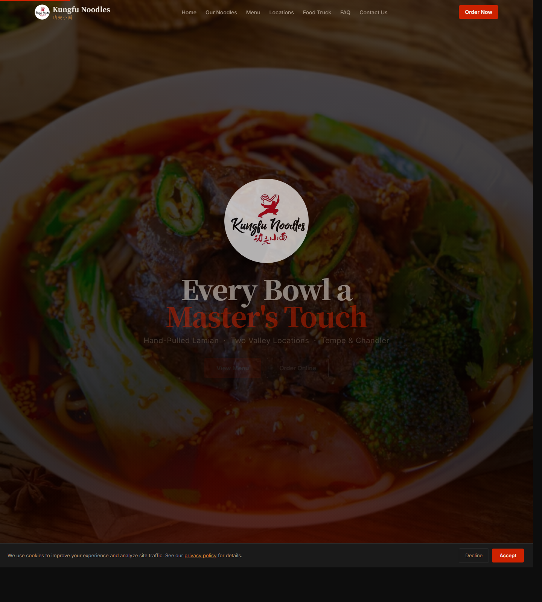
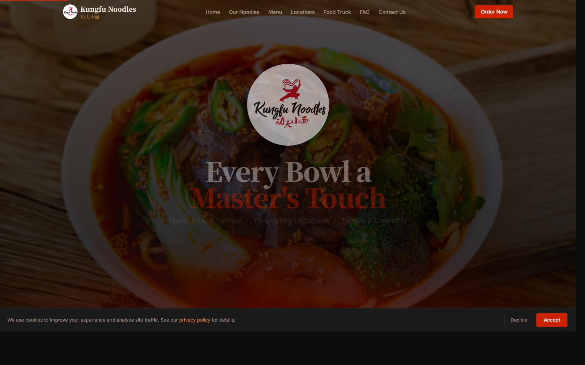
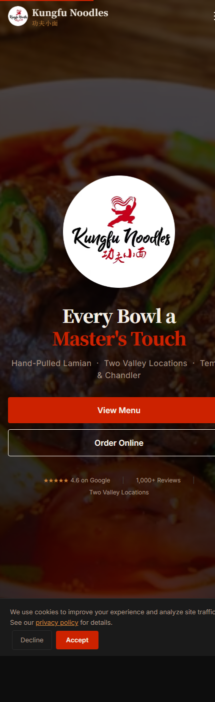

# Kungfu Noodles Website

Built for a local restaurant as a complete redesign and modernization of their web presence.

Marketing website for Kungfu Noodles, a hand-pulled lamian restaurant with Tempe and Chandler locations in Arizona. The site is built with Next.js and presents the brand story, hero messaging, full menu, reviews, food truck information, FAQs, location details, and contact options in a single long-form landing page.

## Project Snapshot

- Brand-forward one-page restaurant site
- Built with Next.js 14, React 18, TypeScript, Tailwind CSS, and Framer Motion
- Optimized for local SEO with metadata, Open Graph tags, structured data, and FAQ schema
- Includes restaurant imagery, menu content, store details, and outbound ordering links

## Screenshots

### Desktop Hero



### Desktop Overview



### Mobile View



## Features

- Full-screen hero with strong visual branding and ordering CTA
- Section-based storytelling for noodles, dishes, reviews, food truck, FAQ, and contact
- Tabbed full menu experience for soups, dumplings, stir-fried dishes, wok dishes, cold dishes, sides, and boba
- Dual-location presentation for Tempe and Chandler with hours, phone numbers, and embedded maps
- Mobile navigation and responsive section layouts
- Structured data for restaurant and FAQ content
- Cookie consent banner

## Tech Stack

- Next.js 14 App Router
- React 18
- TypeScript
- Tailwind CSS
- Framer Motion
- EmailJS browser SDK

## Repository Layout

The deployable app lives in [`kungfu-noodles-site`](./kungfu-noodles-site).

```text
Kungfu Noodles/
|- kungfu-noodles-site/
|  |- app/
|  |- components/
|  |- docs/
|  |  \- screenshots/
|  \- public/
\- README.md
```

## Local Development

1. Open a terminal in [`kungfu-noodles-site`](./kungfu-noodles-site).
2. Install dependencies if needed:

   ```bash
   npm install
   ```

3. Start the development server:

   ```bash
   npm run dev
   ```

4. Visit `http://localhost:3000`.

## Available Scripts

Run these from [`kungfu-noodles-site`](./kungfu-noodles-site):

- `npm run dev` starts the local development server
- `npm run build` creates a production build
- `npm run start` serves the production build
- `npm run lint` runs the Next.js lint task

## Content Notes

- Restaurant metadata, schema, and social tags are defined in [`kungfu-noodles-site/app/layout.tsx`](./kungfu-noodles-site/app/layout.tsx).
- The homepage composition is defined in [`kungfu-noodles-site/app/page.tsx`](./kungfu-noodles-site/app/page.tsx).
- Core sections live in [`kungfu-noodles-site/components`](./kungfu-noodles-site/components).
- Image assets and logo files live in [`kungfu-noodles-site/public/images`](./kungfu-noodles-site/public/images).

## Contact Form Setup

The contact form component currently contains placeholder EmailJS values in [`kungfu-noodles-site/components/Contact.tsx`](./kungfu-noodles-site/components/Contact.tsx):

- `YOUR_EMAILJS_PUBLIC_KEY`
- `YOUR_SERVICE_ID`
- `YOUR_TEMPLATE_ID`

Before using the contact form in production, replace those placeholders with real EmailJS credentials or move them into environment variables for safer configuration.

## Deployment

This is a standard Next.js application and can be deployed to platforms like Vercel or any Node.js host that supports Next.js production builds.

Typical production flow:

1. `cd kungfu-noodles-site`
2. `npm run build`
3. `npm run start`

## Status

The repo previously only had the default generated Next.js README inside the app folder. This root README is intended to serve as the GitHub-facing project overview for the full repository.
